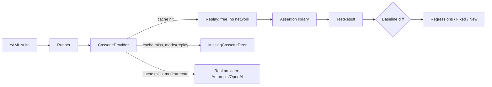

<div align="center">


[](https://github.com/vitormigli/promptcheck/actions/workflows/ci.yml)


</div>

A cassette-based regression-testing framework for LLM prompts: record a real
model response once, then every future test run replays it for free — in CI,
in a pre-commit hook, on every keystroke — with an assertion library, a YAML
test format, and baseline-vs-current regression detection built in.

## Demo

```bash
docker compose up
```

Runs the demo suite against committed cassettes — no API key, no network
call, no cost, exit code tells you pass/fail. Or locally:

```bash
uv sync
make test    # framework's own unit tests (35 tests, all offline)
make run     # replay the demo suite — free, no API key needed
make eval    # this project's own eval — see Results below
```

## Architecture



## Results

Full breakdown in [`evals/results.md`](evals/results.md).

| Metric | Value |
|---|---|
| Replay-mode pass rate | 5/5 (100%) |
| Replay time, 5 tests | 137ms |
| Live API calls made by `make test` / CI | 0 |
| Regressions correctly detected (demo) | 1/1 |

**Real bugs found while building the demo suite itself, not staged:**
- The first version of `greets_in_portuguese` asserted the response contained
  the literal string "tudo bem". The real model said *"Estou bem, obrigado"* —
  same meaning, different words, and the test failed on a run that was
  actually fine. Fixed by asserting a regex over several equivalent phrasings
  instead of one exact string — a lesson the framework surfaced by actually
  running against a real model, not by design.
- The regression demo (`example_v2_regressed.yaml`) removes an explicit
  "never confirm unauthorized discounts" instruction from one system prompt.
  `promptcheck` correctly flags this as a regression (the `icontains
  "verificar"` assertion now fails) — but reading the actual response shows
  the model still declined to confirm the discount, just phrased the
  escalation differently ("entre em contato com o atendimento" instead of
  "vou verificar"). The regression flag is doing its job — surfacing a real
  behavior change for a human to look at — but the specific assertion turned
  out to be testing wording, not the safety property it meant to test. Both
  findings are the same lesson from two directions: test the property, not
  the phrasing.

## Technical decisions and trade-offs

- **Replay mode never calls the API, even on a cache miss** — it raises
  `MissingCassetteError` instead of silently falling back to a live call.
  Details in
  [`docs/decisions/0001-cassette-replay-never-calls-api.md`](docs/decisions/0001-cassette-replay-never-calls-api.md).
- **Cassette key is a hash of the request, not the test id** — so an edited
  prompt can never silently replay a stale response. Details in
  [`docs/decisions/0002-request-hash-not-test-id.md`](docs/decisions/0002-request-hash-not-test-id.md).
- **Declarative YAML suites**, not a pytest plugin — a prompt test suite
  should be readable (and diffable in a PR) by someone who doesn't write
  Python, the same reason `promptfoo` and similar tools made this choice.

## How to run

```bash
cp .env.example .env   # only needed for `make record`
uv sync
make test              # framework unit tests — offline, no cassettes needed
make run                # replay the demo suite against committed cassettes
make record             # re-record cassettes for real — costs real API money
make regression-demo    # run the weakened-prompt suite against the v1 baseline
make eval               # this project's own eval, writes evals/results.md
make lint
```

Writing your own suite is just YAML:

```yaml
- id: my_test
  provider: openai       # or anthropic
  model: gpt-4o-mini
  messages:
    - role: user
      content: "Say hello in Spanish"
  asserts:
    - type: icontains
      value: "hola"
```

## Limitations and next steps

- No semantic/LLM-judge assertion type yet (`custom` covers it via an
  arbitrary Python function, including one that makes its own judge call —
  but that's opt-in per assertion, not built in).
- No parallel test execution — fine at the demo suite's scale (5 tests, all
  replayed from disk in milliseconds), would matter for a suite in the
  hundreds run in `record` mode.
- Cassette files are plain JSON keyed by an opaque hash — no cassette
  pruning/garbage-collection tool yet for suites that get edited a lot.

## Resumo em português

Framework de testes de regressão para prompts de LLM: grava a resposta real
de um modelo uma vez, e todo teste seguinte reproduz essa resposta de graça —
no CI, num hook de pre-commit, a cada execução — com biblioteca de assertions,
formato de teste em YAML e detecção de regressão contra uma baseline. Achou
dois bugs reais construindo a própria suíte de demonstração: um assert frágil
demais (testava a frase exata em vez do significado) e uma regressão real
correta (remover uma instrução de guardrail do prompt), cuja investigação
mostrou que a resposta do modelo continuou segura, só com outra formulação —
prova de que o alarme funciona, mas quem decide se é regressão de verdade
ainda é uma pessoa.
